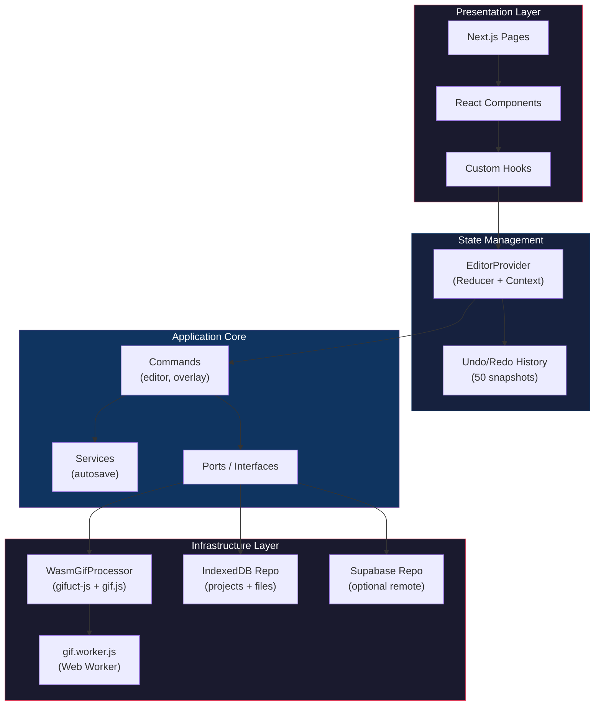
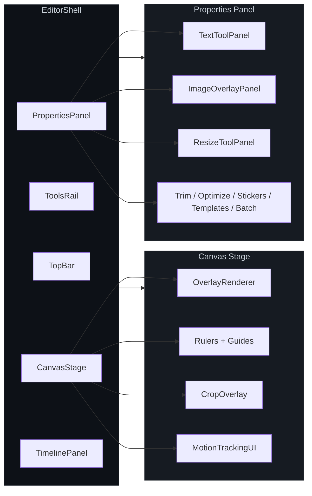
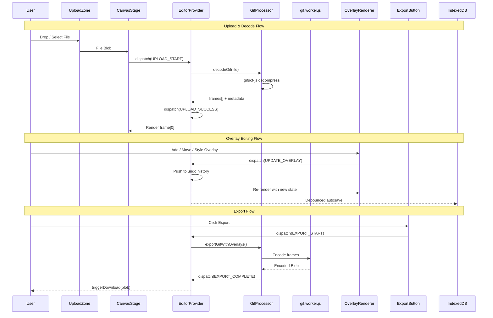
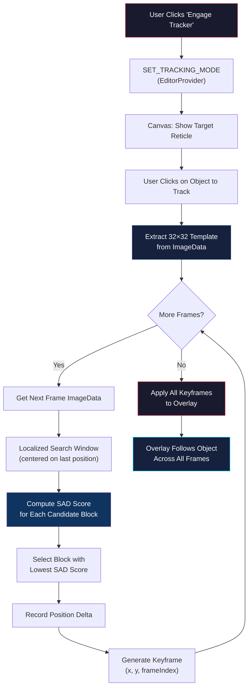
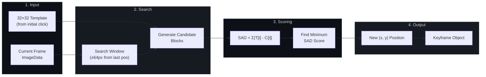

# GifAlchemy Architecture

## 1. Purpose And Scope
GifAlchemy is a browser-native GIF editor built with Next.js App Router. It supports:
- local media import (GIF/MP4/WebM/PNG),
- timeline playback and scrubbing,
- text/sticker/template overlays with keyframes/effects,
- crop/trim/resize/quality controls,
- client-side export through a worker-based GIF encoder,
- local persistence (IndexedDB + localStorage metadata),
- optional Supabase project metadata repository.

This document describes the current implementation in this repository as of the latest code on `main`.

## 2. Technology Stack

### 2.1 Runtime
- `next@15` (App Router)
- `react@19`, `react-dom@19`
- TypeScript strict mode
- Tailwind CSS v4 + Radix UI primitives

### 2.2 Media Processing
- `gifuct-js`: decode and frame decompression
- `gif.js`: GIF encoding (web worker at `public/gif.worker.js`)
- Canvas 2D + ImageData composition pipeline

### 2.3 Persistence / Data
- IndexedDB primary local repository (`projects`, `files` stores)
- localStorage for lightweight UI/project lists/preferences/templates
- Optional Supabase adapter (`@supabase/supabase-js`) for remote project metadata

### 2.4 Quality / Tooling
- ESLint (`next/core-web-vitals` + TS)
- Vitest for unit tests (`tests/unit`)
- Playwright for smoke tests (`tests/smoke`)

## 3. High-Level Architecture



```text
UI (Next.js pages/components)
  -> Hooks (feature orchestration)
    -> Editor Provider (global state + undo/redo + DI)
      -> Application Commands/Services (pure-ish business logic)
        -> Ports (IGifProcessor, IProjectRepository)
          -> Infrastructure Adapters
             - WasmGifProcessorAdapter (gifuct-js + gif.js)
             - IndexedDbProjectRepo
             - SupabaseProjectRepo
```

Design style is layered/ports-and-adapters:
- `core/domain`: entity and value object types.
- `core/application`: command logic, service logic, interfaces/ports.
- `core/infrastructure`: concrete adapters.
- `hooks` and `components`: orchestration and rendering.

## 4. Repository Layout

```text
app/
  page.tsx                         Home/dashboard
  layout.tsx                       Root layout + global toaster
  globals.css                      Theme tokens + effect animations
  (editor)/editor/page.tsx         Editor route entry + runtime DI

components/
  editor/                          Editor shell, panels, canvas, timeline, export
  projects/                        Home project/upload dashboards
  ui/                              Radix-based shared UI primitives
  shared/error-boundary.tsx        Route-level error containment

hooks/
  use-editor.ts                    Editor context accessor
  use-overlays.ts                  Overlay operations (selection, keyframes, grouping)
  use-playback.ts                  RAF timeline playback loop
  use-autosave.ts                  Debounced autosave integration
  use-restore-project.ts           Rehydrate latest saved project
  use-project-persistence.ts       localStorage project-card sync
  use-editor-keyboard.ts           Global shortcuts
  use-frame-thumbnails.ts          Timeline thumbnail sampling
  use-processor.ts                 Processor initialization state
  use-telemetry.ts                 Opt-in telemetry event emitter

providers/
  editor-provider.tsx              Global reducer, history, snapshots, dependencies

core/
  domain/                          `project`, `gif-types`, `presets`
  application/
    commands/                      `editor-commands`, `overlay-commands`
    services/                      `autosave-service`
    processors/                    `gif-processor.port`
    repositories/                  `project-repository.port`
  infrastructure/
    processors/                    `wasm-gif-processor.adapter`
    repositories/                  IndexedDB + Supabase adapters
    supabase/client.ts             lazy browser-only client

public/
  gif.worker.js                    gif.js worker script

tests/
  unit/overlay-commands.spec.ts
  smoke/editor-*.spec.ts
  smoke/manual-checklist.md
```

## 5. Route Architecture

### 5.1 `/` (Home)
File: `app/page.tsx`
- Client-rendered dashboard.
- Loads lightweight project/upload lists from localStorage keys:
  - `gifalchemy:projects`
  - `gifalchemy:uploads`
- Provides navigation to `/editor` and project cards (`/editor?project=<id>` UI link only).

### 5.2 `/editor`
File: `app/(editor)/editor/page.tsx`
- Dynamically imports infrastructure adapters on mount:
  - `WasmGifProcessorAdapter`
  - `createIndexedDbProjectRepo`
- Injects them into `EditorProvider`.
- Wraps in `ErrorBoundary`.

## 6. Core Runtime Components



### 6.1 Editor Provider (`providers/editor-provider.tsx`)
Central source of truth with reducer-driven state.

#### Major state fields
- Media/session: `status`, `file`, `frames`, `metadata`, `currentFrameIndex`
- Tooling/UI: `activeTool`, `isPlaying`, `snapToGrid`
- Overlay system: `overlays`, `selectedOverlayId`, `selectedOverlayIds`
- Export settings: `outputSettings` (`width`, `height`, `format`, `quality`, `crop`)
- Export range/speed: `trimStart`, `trimEnd`, `playbackRate`
- Persistence: `projectName`, `saveStatus`, `snapshots`
- Processing lifecycle: `processorReady`, `processingProgress`, `error`

#### State management capabilities
- Undo/redo with bounded history (`UNDO_HISTORY_MAX = 50`).
- Named restore points (`PROJECT_SNAPSHOTS_MAX = 30`).
- Dependency injection of `processor` and `projectRepo`.
- Abort-controller ref for cancellable exports.
- Shared `contentInputRef` for text editing focus workflows.

### 6.2 Editor Shell (`components/editor/editor-shell.tsx`)
Layout composition and cross-cutting UX:
- Top bar, tools rail, canvas stage, properties panel, timeline.
- Onboarding and shortcuts modals.
- URL sync for playback speed (`?speed=<0.5|1|1.5|2>`).
- Hook registration: restore, keyboard shortcuts, project metadata persistence.

### 6.3 Canvas Stage (`components/editor/canvas-stage.tsx`)
Primary visual editing surface:
- Upload empty state + skeleton/error/processing overlays.
- Canvas rendering of current `ImageData` frame.
- Zoom/pan/rulers/safe-area controls.
- Trim crop overlay (drag/resize handles).
- Delegates overlay rendering/edit gestures to `OverlayRenderer`.

### 6.4 Overlay Renderer (`components/editor/overlay-renderer.tsx`)
Interactive DOM overlay layer above canvas:
- Keyframe interpolation (supports segment easing metadata).
- Drag, rotate, scale handles.
- Smart snap guides to center and nearby overlays.
- Inline double-click content editing.
- Typewriter cursor behaviors and effect-specific animations.

### 6.5 Timeline Panel (`components/editor/timeline-panel.tsx`)
Timeline orchestration:
- Play/pause/stop, frame scrubbing, speed and timeline zoom.
- Trim handles mapped to frame indices.
- Frame thumbnails via `useFrameThumbnails` sampling.
- Layer track bars with draggable temporal shifts.
- Keyframe display and per-segment easing cycling.
- Multi-select with group-aware movement support.

## 7. Tooling Panels And Feature Surface

Active tool IDs (`lib/constants.ts`):
- `resize`, `trim`, `optimize`, `text`, `stickers`, `templates`, `batch`

### 7.1 Resize
- Manual dimensions + aspect lock.
- Presets from `RESIZE_PRESETS`:
  - Original
  - Sticker 128x128
  - Social 480w
  - HD 720w

### 7.2 Trim
- Frame range (`trimStart`, `trimEnd`) with sliders.
- Crop rectangle with numeric controls and on-canvas drag/resize.
- Aspect presets: `free`, `1:1`, `4:5`, `16:9`.
- Crop transform intent fields (`rotation`, `flipX`, `flipY`) tracked in state.

### 7.3 Optimize
- Playback speed options: `0.5x`, `1x`, `1.5x`, `2x`.
- Quality slider (`40..100`).
- Export support matrix UX; non-GIF formats currently indicate fallback.

### 7.4 Text
- Add/remove/duplicate/reorder layers.
- Inline layer visibility/lock toggles.
- Style controls: font, size, line-height, letter spacing, align, color, stroke.
- Effect presets from `ANIMATION_PRESETS` with frame range controls.

### 7.5 Stickers
- Emoji/symbol-based sticker catalog.
- Search/category filter.
- Inserts as text overlays with generated placement.

### 7.6 Templates
- Built-in templates + user-saved custom templates.
- Applies template layers as generated overlays.
- LocalStorage key for custom templates:
  - `gifalchemy.custom-templates.v1`
- Also exposes restore point management via provider snapshots.

### 7.7 Batch
- Multi-layer visibility/lock/effect clear/delete actions.
- Group/ungroup, align, distribute selected layers.
- Global nudge snap toggle.

## 8. Domain Model

### 8.1 Media domain (`core/domain/gif-types.ts`)
- `GifFrame`: decompressed frame image data + delay + disposal.
- `GifMetadata`: dimensions, frame count, total duration, file metadata.
- `ProcessingResult`: encoded blob details.

### 8.2 Project domain (`core/domain/project.ts`)
Primary persistent aggregate:
- `Project`
  - `sourceFile`
  - `timeline` (`duration`, `frameCount`, `overlays`)
  - `outputSettings`
  - `trimStart`, `trimEnd`, optional `playbackRate`
  - optional `templates`, `snapshots`
- `Overlay` (currently `type: "text"`) with keyframes/effects/visibility/lock.
- `Keyframe`: `frameIndex`, `x/y`, `scale`, `rotation`, `opacity`.
- `Effect`: animation type + range + easing.
- `OutputSettings`: output dimensions, format, quality, optional crop rect.

Note: UI currently stores some extended overlay style attributes beyond strict domain typing through permissive update flows (for advanced fills/shadows/typewriter options).

## 9. Application Layer

### 9.1 Commands
- `editor-commands.ts`
  - `decodeGif`
  - `exportGif`
  - `exportGifWithOverlays`
  - `triggerDownload`
- `overlay-commands.ts`
  - create/update/remove overlay
  - keyframe interpolation insertion
  - effect bake and clear

### 9.2 Services
- `autosave-service.ts`
  - Debounced save (`DEBOUNCE_MS = 2000`)
  - Immediate flush on `visibilitychange` / `pagehide`
  - Publish-subscribe state model (`saving|saved|error`)

### 9.3 Ports
- `IGifProcessor`
- `IProjectRepository`

These interfaces isolate core UI/application behavior from specific media engines and storage backends.

## 10. Infrastructure Layer

### 10.1 GIF Processor Adapter
File: `core/infrastructure/processors/wasm-gif-processor.adapter.ts`

Responsibilities:
- Lazy-load `gifuct-js`.
- Decode frames with disposal handling and compositing logic.
- Trim and optional crop pipeline.
- Canvas-based resize.
- Optional overlay compositing (text, typewriter runtime behavior).
- Encode via `gif.js` using worker script `/gif.worker.js`.
- Progress callbacks and abort support.

Export flow phases generally report:
- Decoding -> Decoded -> Compositing (if overlays) -> Encoding -> Done

### 10.2 IndexedDB Repository
File: `core/infrastructure/repositories/indexeddb-project-repo.adapter.ts`

Database:
- `DB_NAME = "gifalchemy-projects"`
- `DB_VERSION = 2`
- Stores:
  - `projects` (keyPath `id`)
  - `files` (keyPath `id`, raw source blob buffer)

Implements `save/load/list/delete`.

### 10.3 Supabase Repository (Optional)
File: `core/infrastructure/repositories/supabase-project-repo.adapter.ts`

- Reads browser env vars:
  - `NEXT_PUBLIC_SUPABASE_URL`
  - `NEXT_PUBLIC_SUPABASE_ANON_KEY`
- Table: `projects`
- Persists project metadata JSON (`fileBlob` currently not persisted remotely).

### 10.4 Supabase Client Loader
File: `core/infrastructure/supabase/client.ts`
- Browser-only lazy creation.
- Returns `null` when SSR or env missing.

## 11. Data Flow Specifications



### 11.1 Upload + Decode
1. User uploads file via `UploadZone`.
2. `CanvasStage` dispatches `UPLOAD_START`.
3. `decodeGif(processor, file)` called.
4. Provider receives `UPLOAD_SUCCESS` with frames/metadata.
5. Output defaults to source dimensions; trim defaults to full range.

Constraints:
- Max file size: `50MB` (`MAX_FILE_SIZE`).
- Accepted MIME/extensions: GIF, MP4, WebM, PNG.

### 11.2 Playback
1. `usePlayback` tracks `isPlaying` and frame delays.
2. RAF loop advances according to per-frame delay / playbackRate.
3. Loop is constrained to trim window `[trimStart..trimEnd]`.

### 11.3 Overlay Editing
1. `useOverlays` performs command-level mutations.
2. Provider reducer applies updates.
3. `OverlayRenderer` interpolates and renders live state.
4. Timeline and properties panels stay synchronized from same source state.

### 11.4 Export
1. `ExportButton` starts processing and attaches `AbortController`.
2. Chooses path:
   - `exportGifWithOverlays` if visible overlays exist.
   - `exportGif` otherwise.
3. Processor emits progress; UI shows blocking progress overlay.
4. Result blob downloaded with normalized file name:
   - `{project}-{width}x{height}.{format}`

### 11.5 Autosave + Restore
Autosave:
- `useAutosave` builds `Project` snapshot from current editor state.
- Debounced `repo.save(project, fileArrayBuffer)`.

Restore:
- `useRestoreProject` loads latest project summary from repo list.
- Decodes persisted source blob.
- Dispatches `RESTORE_PROJECT` with overlays/settings/trim/speed/snapshots.

## 12. Persistence Surface

### 12.1 IndexedDB (authoritative project persistence)
- Project metadata + source file bytes.

### 12.2 localStorage (UI metadata / convenience)
- `gifalchemy:projects` -> homepage card list cache
- `gifalchemy:uploads` -> upload list on homepage
- `gifalchemy:onboarding:v1` -> onboarding seen flag
- `gifalchemy.custom-templates.v1` -> user templates
- `gifalchemy.telemetry.opt_in` -> telemetry consent

## 13. Event Bus (Window Custom Events)
Used as lightweight cross-component signaling:
- `gifalchemy:export-request`
- `gifalchemy:open-shortcuts`
- `gifalchemy:decode-profile`
- `gifalchemy:telemetry-consent-changed`
- `gifalchemy:telemetry-event`

## 14. Error Handling And Resilience
- Route-level `ErrorBoundary` wraps editor page.
- Upload/decode/export errors map to user-visible messages/toasts.
- Export supports cancellation via `AbortController`.
- Autosave failure sets `saveStatus = error` but keeps session in-memory.
- Restore logic retries later if initial restore fails.

## 15. Performance Characteristics
- Media work stays client-side (privacy and no network transfer for editing/export).
- Decode/composite/resize uses Canvas/ImageData (CPU/memory heavy on large assets).
- GIF encoding runs through worker-backed `gif.js` to reduce main-thread blocking.
- Timeline thumbnails are sampled (`MAX_THUMBNAILS = 48`) to cap overhead.

## 16. Security And Privacy
- No server upload required for core editor workflows.
- Supabase integration is optional and browser-configured.
- No secret material stored in repo; env-driven public keys only for Supabase client.
- User content persisted locally unless remote repo is explicitly configured/used.

## 17. Testing And Validation

### 17.1 Unit
- `tests/unit/overlay-commands.spec.ts`
- Validates keyframe interpolation/effect bake/clear semantics.

### 17.2 Smoke (Playwright)
- `tests/smoke/editor-interactions.spec.ts`
- `tests/smoke/editor-export.spec.ts`

### 17.3 Manual
- `tests/smoke/manual-checklist.md`
- `scripts/release-checklist.mjs` generates `docs/release-checklist.md` and runs:
  - lint
  - unit tests
  - optional smoke tests (`RUN_SMOKE=1`)

## 18. Configuration Specs
- `next.config.ts`: `reactStrictMode: true`
- `tsconfig.json`: strict mode, alias `@/*`
- `playwright.config.ts`: Chromium smoke setup with optional external base URL
- `vitest.config.ts`: node environment for `tests/unit/**/*.spec.ts`

## 19. Current Constraints / Known Gaps
- Export engine currently produces GIF output; non-GIF formats are represented in UI but not implemented as native encoder paths.
- Some overlay advanced style properties are applied in UI via dynamic fields not fully reflected in strict domain typings.
- Home route project cards are localStorage-backed summaries; authoritative project payloads are in IndexedDB repo.
- Heavy GIFs can stress browser memory/CPU due to full-frame ImageData workflows.

## 20. Extension Points
Recommended extension seams:
- Add processor implementations by conforming to `IGifProcessor`.
- Add storage backends by implementing `IProjectRepository`.
- Expand overlay model and effect engine in `core/domain/project.ts` + `overlay-commands.ts`.
- Add richer telemetry sink by subscribing to emitted telemetry custom events.

## 22. Advanced Motion Tracking System

GifAlchemy implements a high-performance, browser-native motion tracking system for overlays. This allows text and images to automatically follow dynamic subjects within a GIF.



### 22.1 Core Algorithm: Sum of Absolute Differences (SAD)
File: `lib/motion-tracker.ts`



The tracker uses a block-matching algorithm optimized for the browser:
1. **Template Selection**: Upon user click, a 32x32 pixel "template" is extracted from the current frame's `ImageData` around the click coordinates.
2. **Localized Search**: For each subsequent frame, the algorithm searches within a designated "Search Area" (centered at the last known position) to find the region that most closely matches the template.
3. **SAD Calculation**: The algorithm computes the Sum of Absolute Differences for every candidate block:
   ```js
   score = sum(|template[i] - candidate[i]|)
   ```
   The block with the lowest SAD score is identified as the new position.
4. **Adaptive Anchoring**: The system handles frame-to-frame jitter by normalizing coordinates within the coordinate space of the current project zoom level.

### 22.2 Motion Keyframe Generation
After tracking is complete, the system automatically translates the relative movement into standard project `Keyframe` objects:
- **X/Y Offset Mapping**: The delta movement of the tracked object is applied to the overlay's base coordinates.
- **Auto-Tweening**: Generates discrete keyframes for every frame in the tracking range to ensure perfect alignment, bypassing standard interpolation when precision is required.

## 23. Premium UI & Cinematic Effects

GifAlchemy prides itself on a "Studio-Grade" user experience, utilizing several advanced visual systems:

### 23.1 Surface & Atmosphere
- **Reactive Studio Cursor**: A dynamic pointer system that changes color and scale based on canvas interaction, providing tactile feedback.
- **Atmospheric Background**: A multi-layered background system combining a dynamic CSS mesh grid with an animated SVG noise grain to create a high-end SaaS aesthetic.
- **Advanced Glassmorphism**: Pervasive use of `backdrop-filter: blur(50px)` combined with ultra-thin `1px` borders and internal shadows (`inset`) to simulate premium hardware materials.

### 23.2 Cinematic Preview System
- **Dynamic Optical Vignette**: During preview mode, a radial gradient mask is applied to focus user attention on the center of the canvas.
- **Spotlight Focus**: The canvas container dims peripheral elements when in cinematic mode, creating a "theatrical" viewing experience.
- **Kinetic Timeline**: Timeline scrubbing uses physical momentum and snapping logic to provide a professional editing feel.

## 24. Operational Commands
- Install: `npm install`
- Dev server: `npm run dev`
- Lint: `npm run lint`
- Unit tests: `npm run test:unit`
- Smoke tests: `npm run test:smoke`
- Production build: `npm run build`
- Release checklist: `npm run release:checklist`
